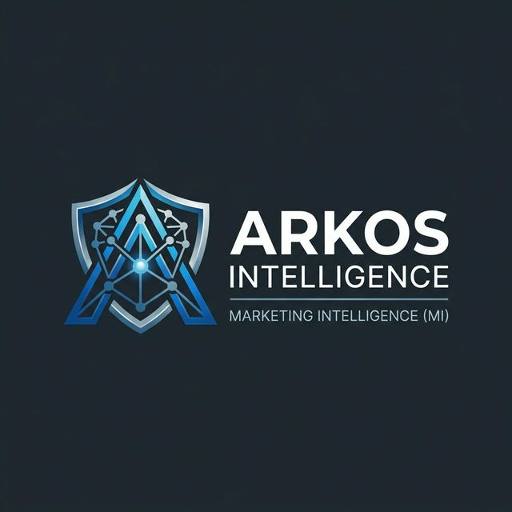

# <p align="center">ARKOS MI — Análise de Sentimentos</p>

<p align="center">
  
</p>

<p align="center">
  <strong>Motor de PLN do módulo Marketing Intelligence da plataforma ARKOS</strong>
</p>

<p align="center">
  
  
  
  
</p>

---

## 🚀 Sobre o Projeto
A **ARKOS** é uma infraestrutura de inteligência corporativa brasileira focada em elevar o nível de maturidade analítica das organizações (Framework de Davenport). O módulo **MI (Marketing Intelligence)** é o motor de reputação, NPS e inteligência profunda de mercado.

Este repositório contém o **Startup Signal Intelligence**, um sistema que aplica Processamento de Linguagem Natural (PLN) para analisar narrativas de startups e predizer indicadores de sucesso e engajamento.

## 🏗 Arquitetura do Sistema
O sistema é dividido em 3 etapas fundamentais:

1.  **Etapa 1: Estruturação Narrativa (Regex + spaCy)**
    *   Limpeza de texto e extração de "Trust Markers".
    *   NER (Reconhecimento de Entidades Nomeadas) e extração de Propostas de Valor.
2.  **Etapa 2: Coleta & Capital Social (Scraping + NLTK)**
    *   Coleta de dados via APIs e Web Scraping.
    *   Análise de Capital Social Digital (frequência, regularidade e engajamento).
3.  **Etapa 3: Inferência Semântica (Transformers + Classificação)**
    *   Análise de sentimentos profunda com HuggingFace.
    *   Classificação de tipos narrativos (Societal-Solution vs Product-Centric).

## 🧪 Base Científica
O projeto fundamenta-se nas seguintes pesquisas de ponta:
- **Qiu et al. (2025):** BERTweet + early fusion para predição de financiamento.
- **Peixoto et al. (2023):** LDA + fases de vida de startups via Twitter.
- **Saura et al. (2019):** LDA + SVM para indicadores de sucesso de startups.
- **Jin, Wu & Hitt (2017):** Sinais sociais públicos como preditores de captação.
- **Cheng (2024):** Presença multicanal como aceleradora de legitimidade (R² up to 0.78).

## 🛠 Instalação
```bash
# Clone o repositório
git clone https://github.com/Renatoassis86/analise_sentimentos.git
cd analise_sentimentos

# Crie um ambiente virtual
python -m venv venv
source venv/bin/activate  # Windows: venv\Scripts\activate

# Instale as dependências
pip install -r requirements.txt

# Baixe o modelo do spaCy
python -m spacy download pt_core_news_lg
```

## 📖 Uso Rápido
Consulte os arquivos no diretório `notebooks/` para uma execução guiada passo a passo de cada etapa do pipeline. Para uso em produção, importe as funções do diretório `src/`.

---

**Créditos:** 
ARKOS Intelligence | **Renato Assis**
